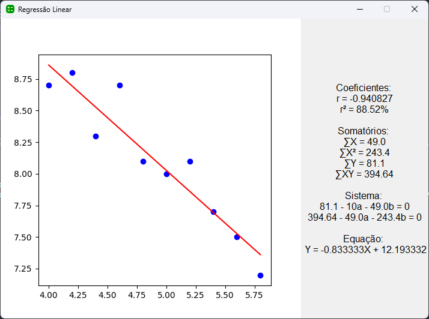

# Least_Squares_Method

# 1. Código-fonte

Como trabalho proposto na disciplina de Métodos Numéricos, o objetivo era desenvolver uma aplicação que implementa a Regressão Linear pelo método dos mínimos quadrados.
O design da apalicação foi efetuado através de 3 módulos, o **InterfaceEntrada.py**, **InterfaceSaida.py** e **CalculoRegressaoLinear.py**, sendo o módulo que inicializa a aplicação o **InterfaceEntrada.py**.

**OBS.:**Certifique-se de instalar previamente as bibliotecas utilziadas antes de executar a aplicação

1. pip install numpy
2. pip install tkinter
3. pip install matplotlib

## 2.1 Entradas

- Vetor X = 4, 4.2, 4.4, 4.6, 4.8, 5, 5.2, 5.4, 5.6, 5.8
- Vetor Y = 8.7, 8.8, 8.3, 8.7, 8.1, 8, 8.1, 7.7, 7.5, 7.2
- Nº de casas decimais = 6

## 2.2 Saídas

